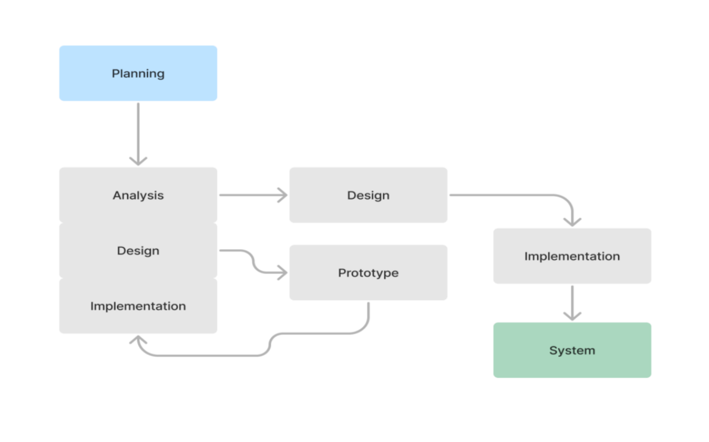
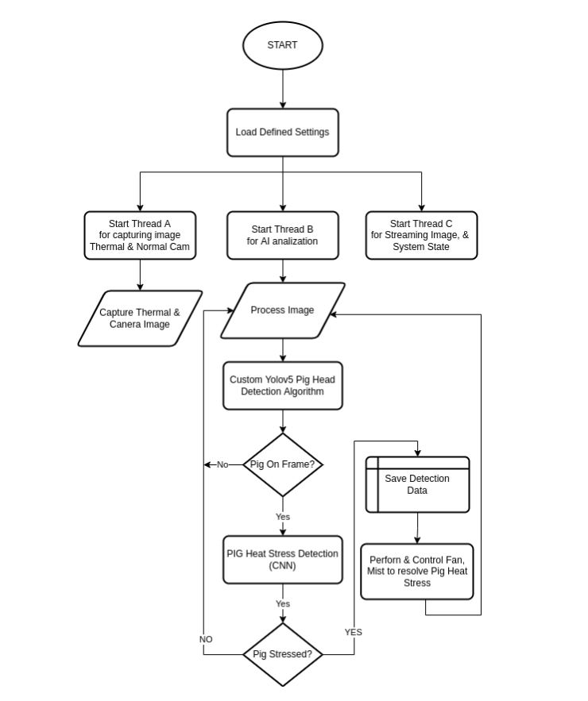

#
# Welcome To PHS Developers Guide
## Introduction
 This software is built specifically for PHS. This guide will provide the current developers the enough knowledge about the system help them in improving the site.

## System Design

The Developers used _**Rapid Throwaway Prototyping**_ approach. Before the real system
is built conducting and analyzing is being implemented.




## Program FlowChart

&nbsp;&nbsp;&nbsp;&nbsp;&nbsp;&nbsp;The PHS Machine uses _**Python**_ and _**Flask**_ and it will be initialized at the start. First, the system will initialize all global variables for storing the raw thermal
data, and image, as well as other system variables & configuration variables that will be needed by the system. After initializing the variables, the python flask will start 2 other independent threads. 


## System FlowChart

&nbsp;&nbsp;&nbsp;&nbsp;&nbsp;&nbsp;The system website can serve as the **control center** of the entire system where the owner can monitor the real-time status of the system and add or change configuration on how will the system respond to heat stress events.


## Conceptual Framework

&nbsp;&nbsp;&nbsp;&nbsp;&nbsp;&nbsp;The first process will begin on the MLX90640 thermal camera & a
5 Megapixel camera for capturing pig heat stress. The data that has been collected will be passed to raspberry pi and it will now process the raw data. The raspberry pi 4 model B will serve as the controller and server of the entire system. The raspberry pi will use the MLX90640 thermal camera & a 5 Megapixel camera for capturing normal images of pigs present in the frame. Then the system will feed the current image frame to the YOLOV5 which is custom trained by the researcher to detect a pig’s head only if it is visible on theframe. After identifying the coordinates of the pig’s head (BBOX), the coordinates of it will
be passed and mapped to get the matching thermal image coordinates. This thermal
image which was cropped based on the coordinates returned by the YOLOV5 will be the
input for the Convolutional Neural Network. The neural network is also trained for looking
at heat patterns on the input thermal images. The CNN will return a classification if the
pig is currently having heat stress or not. If heat stress is present, then, the system will
spray or sprinkles water or mist after detecting, analyzing, and classifying if the pigs are
stressed or not.


## Technologies

This project is build using the following technology.
* Next.js
* Nodejs
* python3
* Mongoose
* Tailwind
* daisyUI
* anaconda
## Repository
To run PHS localy, we need to install required dependencies. Then we need to run PHS backend & Front end.

## Deployment
&nbsp;&nbsp;&nbsp;&nbsp;&nbsp;&nbsp;Frontend & Backend Both Front End & Back End where deployed to Heroku. Please ask the PHS Heroku credential from the PHS Admin or PHS IT Personel.

Database Deployment
The PHS database is using MongoDB and it is deployed via MongoDb Atlas

The string bellow is the connection for the database. Ask the password from the PHS Admin or PHS IT Personel

```nvm
 mongo db path goes here
```
## Requirements
Make sure you have NPM, Node installed in your system, MongoDb Community Edition (Optional) for local development.

## Installation
If you are a developer who is hired to improve, fix bugs, or add features to this website, follow the video or the instructions bellow.

### PHS Dev Guide

#### Watch Full Guide Here
 
Below is the process of setting up the front end and server.

In github, click the Green button with the text ‘Code’. Choose Download Zip. or clone using git
```sh
 git clone [phs](https://github.com/Senpai-Coders/CAPSTONE-PHS-Machine)
```