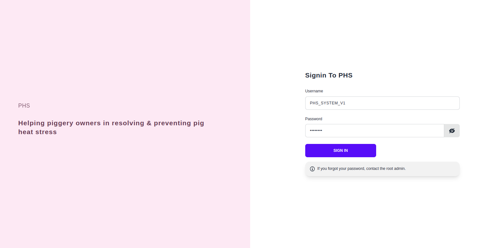
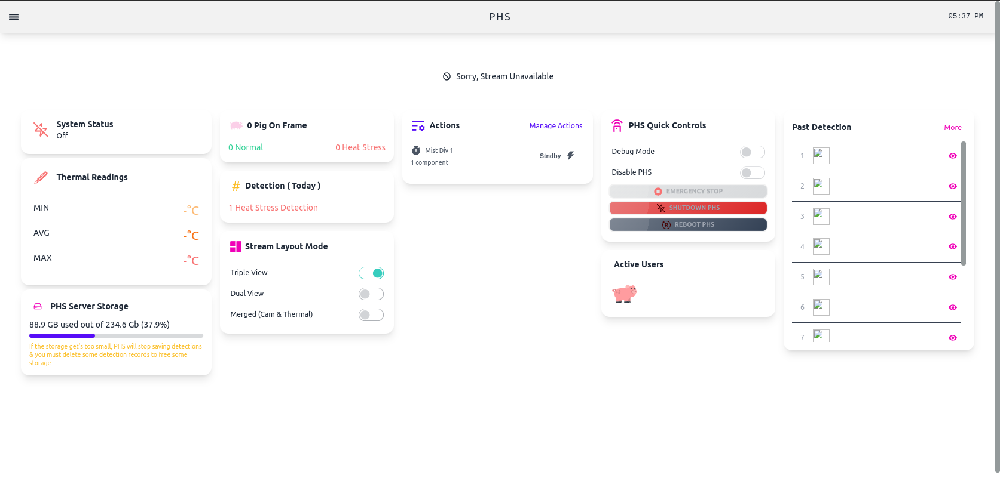
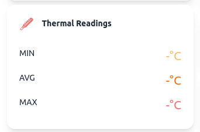
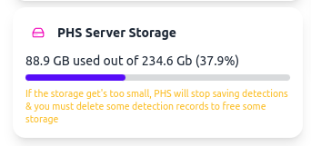
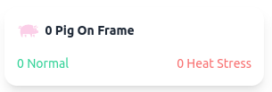
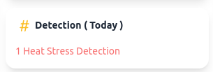
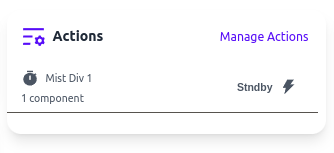
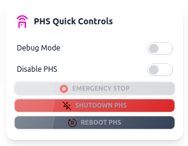

#
# Welcome to User's/Admin Guide
This will help user on how to navigate & operate the system.

## How to Login to PHS
>**Step 1**: You must first have an account that is given by Admin or Root Admin. Contact your Developers. **[Contacts](/Contacts/contact.md)** 

>**Step 2**: Go to this link [PHS](https://github.com/Senpai-Coders/CAPSTONE-PHS-Machine.git).

    
>**Step 3**: Type your credentials into the text box of login page of PHS,
 then Click the button **Sign In**. 

## Navigate PHS
>### Main Page
> * After you login your credentials into Log in page, it will direct you to the Main page of PHS.   *In Main Page. You will see different functionalities sush as:*
>   * System status
>   * Thermal Reading
>   * Server Storage
>   * Pig On Frame
>   * Detection
>   * Stream Layout
>   * Actions
>   * Active Users
>   * Quick Control
>   * Past Detection

 ## Deep dive into Main page
>### System status
&nbsp;&nbsp;&nbsp;&nbsp;&nbsp;&nbsp;_System status_ will allow the user's to know if the System is **On** or  **Not**.

&nbsp;&nbsp;&nbsp;&nbsp;&nbsp;&nbsp;

>### Thermal Reading
&nbsp;&nbsp;&nbsp;&nbsp;&nbsp;&nbsp;In _Thermal Readings_, User's will know the Minimum, Average, Maximum reading of temperature.

&nbsp;&nbsp;&nbsp;&nbsp;&nbsp;&nbsp;

>### Server Storage
&nbsp;&nbsp;&nbsp;&nbsp;&nbsp;&nbsp;_Server storage_ will let the user's know the capacity storage of PHS.

&nbsp;&nbsp;&nbsp;&nbsp;&nbsp;&nbsp;

&nbsp;&nbsp;&nbsp;&nbsp;&nbsp;&nbsp;**_NOTE_:** if the capacity storage get's too small the PHS will stop saving Detections.

>### Pig on Frame
&nbsp;&nbsp;&nbsp;&nbsp;&nbsp;&nbsp;_Pig_ on Frame will let the user's know which pig run into **Heat Stress** or **Not** .

&nbsp;&nbsp;&nbsp;&nbsp;&nbsp;&nbsp;

>### Detections
&nbsp;&nbsp;&nbsp;&nbsp;&nbsp;&nbsp;_Detection_ will let the user's know which pig run into **Heat Stress**, just for "today".

&nbsp;&nbsp;&nbsp;&nbsp;&nbsp;&nbsp;

>### Stream Layout
&nbsp;&nbsp;&nbsp;&nbsp;&nbsp;&nbsp;_Stream layout_ will let the user's change the layout mode, it could be the following: **Triple** View, **Dual** View, **Merged**(Normal Cam and Thermal).

&nbsp;&nbsp;&nbsp;&nbsp;&nbsp;&nbsp;

>### Actions
&nbsp;&nbsp;&nbsp;&nbsp;&nbsp;&nbsp;Lorem Ipsum is simply dummy text of the printing and typesetting industry. Lorem Ipsum has been the industry's standard dummy text ever since the 1500s, when an unknown printer took a galley of type and scrambled it to make a type specimen book.

&nbsp;&nbsp;&nbsp;&nbsp;&nbsp;&nbsp;

>### Active Users
&nbsp;&nbsp;&nbsp;&nbsp;&nbsp;&nbsp;It will Allow the user's know which user is Active.

&nbsp;&nbsp;&nbsp;&nbsp;&nbsp;&nbsp;

>### PHS Quick Control
&nbsp;&nbsp;&nbsp;&nbsp;&nbsp;&nbsp; Quick Control has a major crucial part or control in PHS.  User's can **Debug** mode and **Disable** PHS. User's can execute 3 commands such as: **Emergency Stop**, **Shutdown**, and **Reboot**. 

&nbsp;&nbsp;&nbsp;&nbsp;&nbsp;&nbsp;

