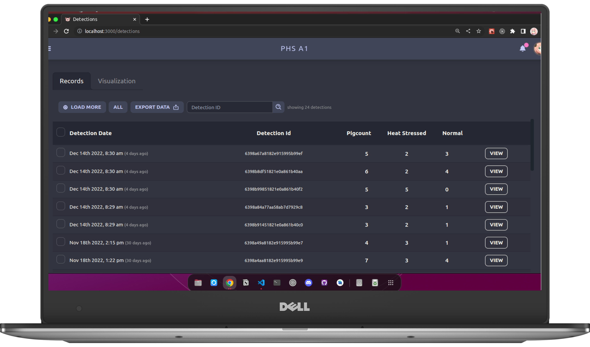
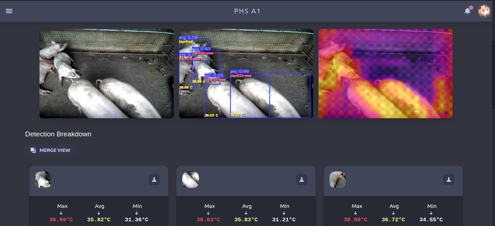
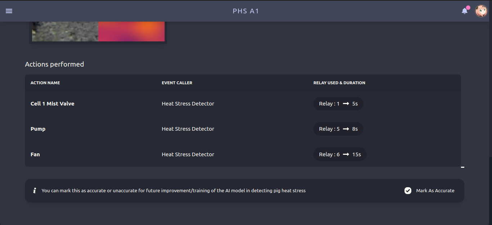
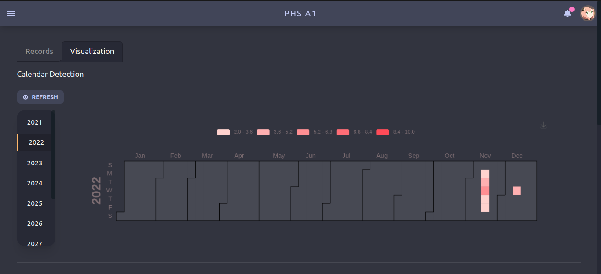
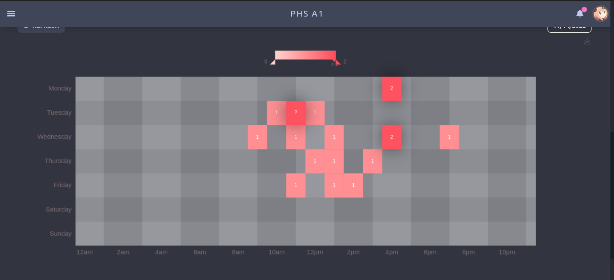
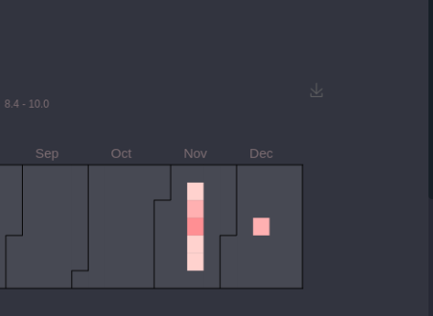

# Detection Page

Detection page contains all detection records that has been recorder by the system. You can view and manage this records here.

## Records Tab

This shows tabular view of the datas. You can **view, export, or delete** them.

### View 

You can view more informations about a chosen detection

#### PHS Actions

This indicates the actions that the system did to resolve the problem

## Visualization Tab

This shows different visualization of all the detection data.

### Yearly Chart

This visualize **all counts** of detections that happens **everyday** throughout the selected year (default current year). This might help us see patterns easily on what month Heat Stress occurs the most.

### Weekly Chart

This visualizes **all counts** of detections and what **hour** the detections happens spanning 7 days from the selected date (default starting from current day). This will help us visualize what hour Heat Stress occurs the most.

> **Tip** : you can download the visualization charts via download icon on the upper right corner of the chart 

