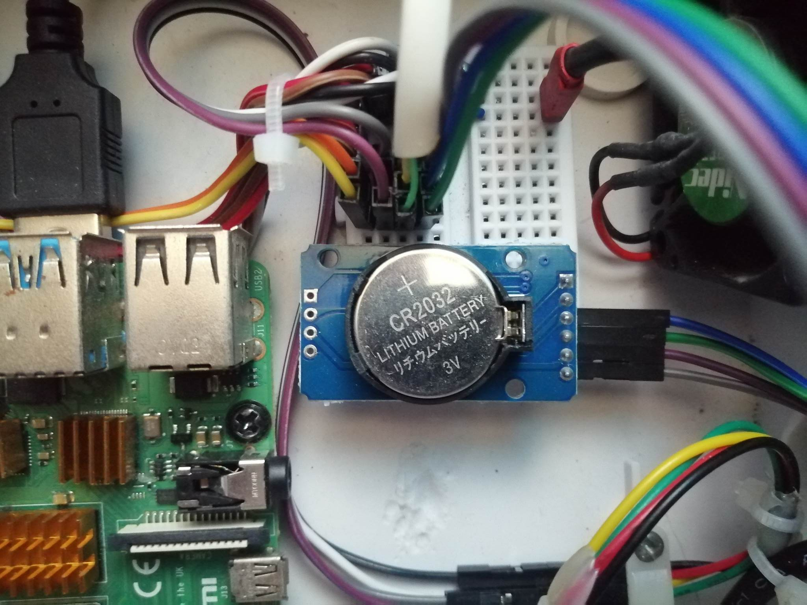
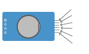
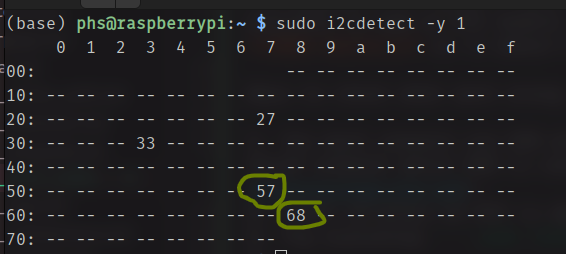

# PHS Error Codes

PHS may encounter **errors** in future. **Error codes** may help admins, developers on **tracing** or knowing what is the **caused** of error and the **possible fix**.

Error codes might appear on the **bell notification** located at the nav bar or Error codes might appear on the **Log page**

## Error Code **-1**

This error indicates that the PHS cannot **reset** or **initialize** it's initial settings due to **PHS default factory file configuration** can't be accessed or not found.

The default file configuration ```phsV1Defaults.json``` which is located at ```phsmachine_web/defaults/```. You can check if the file exist.

#### Possible Solution
- Try downloading the ```phsV1Defaults.json``` file from the [github repository phsmachine_web/defaults/](https://github.com/Senpai-Coders/CAPSTONE-PHS-Machine/tree/main/phsmachine_web/defaults)

## Error Code **0**

This indicates that the **PHS Detection System** of PHS is **not running** or **can't be reached**. This may result to the possibility that it is **not running**. 

#### Possible Solution
- Check if router is responding or try rebooting the router or reboot both router & PHS
- Try rebooting the system
- Try reading the system log at the logs page
- Try reading the phs_system.service service logs
```
journalctl -u phs_system.service
```

## Error Code **1**

This indicates that the **Web Service** of PHS is **not running** or **cannot be reached**. This might be local network issue or the Web service failed to run.

#### Possible Solution
- Check if router is responding or try rebooting the router or reboot both router & PHS
- Try reading the phs_web.service logs
```
journalctl -u phs_web.service
```

## Error Code 3

This indicates that PHS storage **exceeds 95%** of the total storage.

#### Possible Solution
You can **old records** at the **detection page**  to free up some space.

> **TIP** You can follow the maintenance guid which include maintaining the PHS storage.


# Possible Undocumented Errors

We **highly encourage** to report **errors** that are **not** in this manual/documentation inorder to improve the system's error handling and support.

#### Email the developer & send the following

- Log Files (Both PHS Web & PHS Detection System Logs)

> **TIP** : You can download the logs at the Log Page

> **TIP** : You can also connect via SSH or VNC to the phs and on terminal you can run ```journalctl -u phs_system.service``` && ```journalctl -u phs_web.service``` to view the logs, and take a screenshot of the errors.

- Description of what wen't wrong (on your own words)
- Date of error

# Errors/Problems with no error code

## Time is not correct

The Raspberry Pi doesn't have a **Real Time Clock Module (RTC)**, but possible to add an RTC module via **i2C**. The RTC module has a standard **CMOS Battery** so it doesn't loose it's time even if the PHS is unpluged.



RTC Pinout


> **Note** : remember the arrangement of the wire. This is the i2c bus connection which include 4 wires connecting to SCL, SDA, VCC, GND. You might be required to replace the wires sometime in the PHS lifespan.

Ways to check what went wrong. 

1. You must connect via SSH with your Laptop/PC that is connected on the same local network which PHS is connected. [Access Via SSH](_page_access_auth?id=accessing-via-ssh)
2. Try executing ``` sudo i2cdetect -y 1 ```
this should include address of **57** & **68**
if not the RTC wires have damage or the battery need to be replaced.

3. Check if wires on RTC is damaged, try moving the wire & replace if necessary. Repeat step 2 to check the RTC

4. Replace by a standard CMOS Battery. After replacing try doing step 2
5. If replacing the batter solved the problem, please connect the PHS machine to a router that has an Internet for it to be able to obtain a correct time.