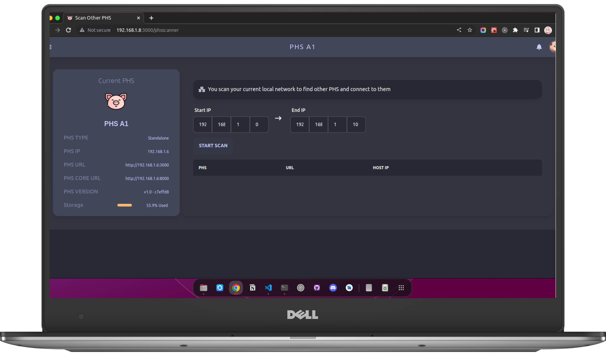

# Other PHS Scanner

If there are other PHS connected on the same network, you can connect to other PHS Devices. Due to PHS is a **stand alone** system. It doesn't rely on other PHS devices. Instead you can scan and connect to them by yourself. Make sure the admin created an account for you in the other PHS Devices.