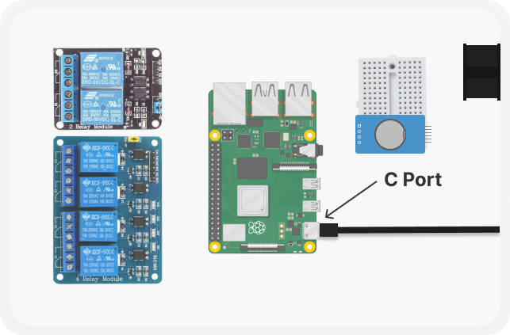
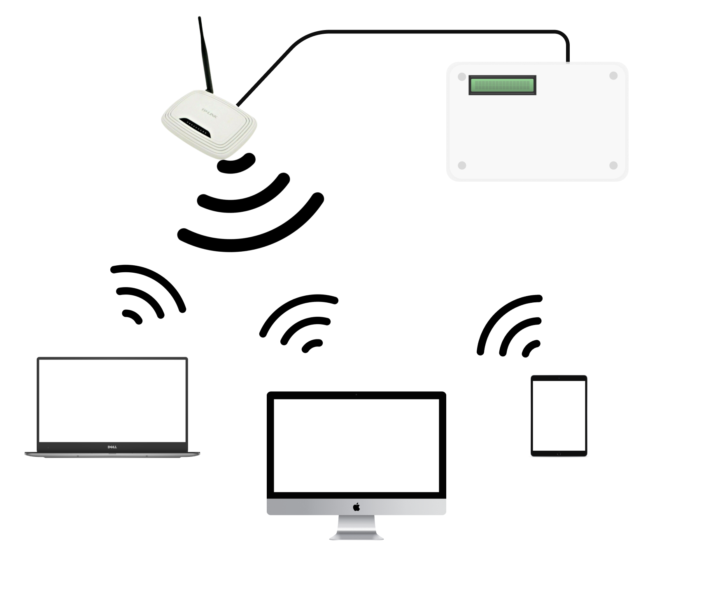
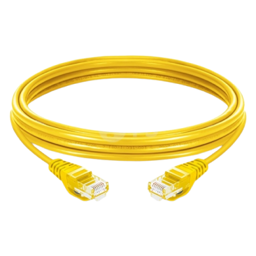
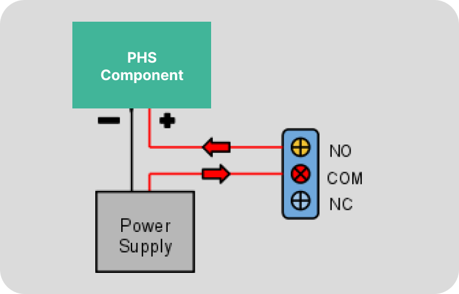
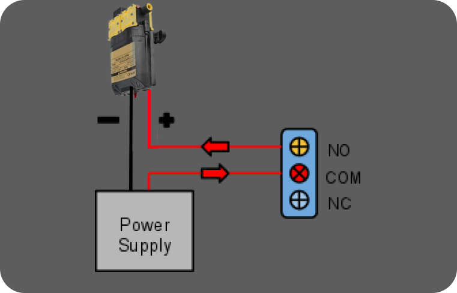
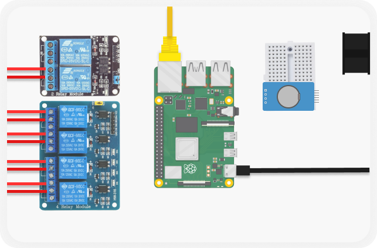
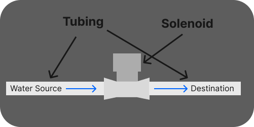
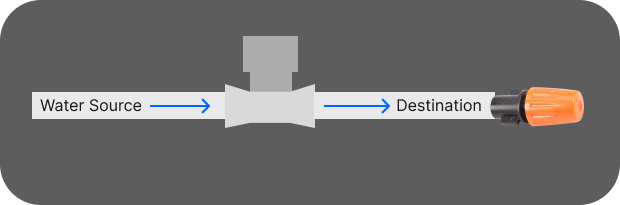
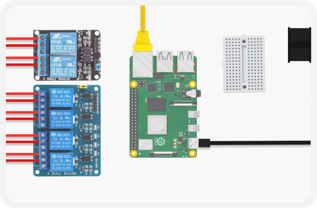
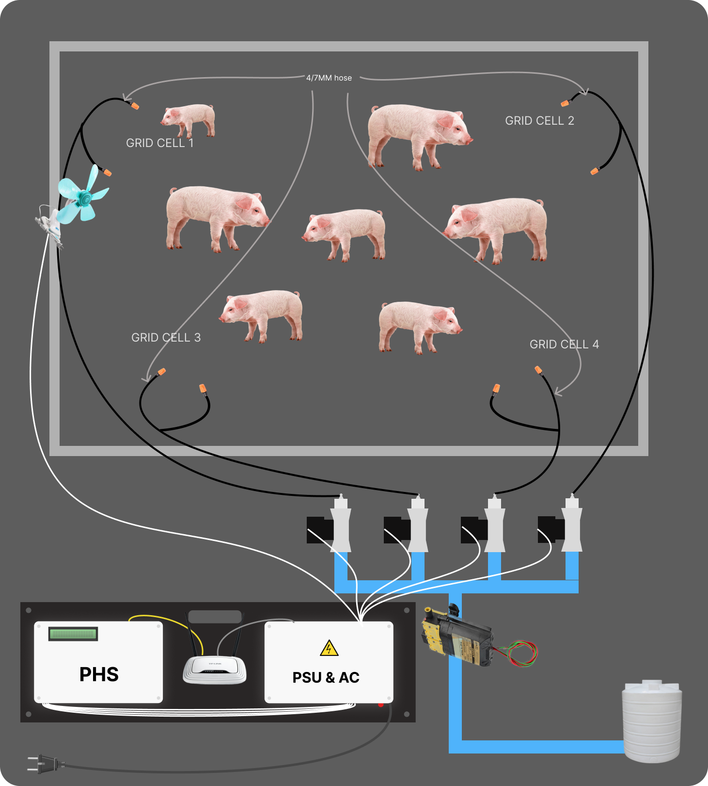

# Physical Installation

    

Out of the box, PHS Machine is configured by the developer. Only the wiring of other components are not pre-installed & you have to install it by yourself on the PHS.

## Placing PHS

PHS Box contains the heart & brain of the system. You can place it anywhere safe on the piggery. You should place it near the pigs where the position of PHS is **final** but should **not reachable** by the pig.

## Opening PHS Case Box

    

Once PHS is installed in place. We can now install other components needed by PHS. But first let's open the case where it is held by **4 screws**. Unscrew this to open the PHS.

> **NOTE** : Ignore the wires that are pre installed.

Once opened. This is what PHS contains. It contains **Relays, Raspberry Pi, Breadboard, & Fan**.

## Attatch PHS Power 

PHS has its power adapter which is a **type c**. Pass it through the PHS port holes and connect it to the **C port** of Raspberry Pi.

## Local Network 

PHS need a **local network** so that the website can be accessable via local network on **any** devices that have a **web browser**. 

> **Note** : PHS Doesn't need a Internet, just a router that can function properly to create a local network. But if internet does exist, PHS will enable its feature **notification via email**.

## Connecting PHS to router

PHS comes with 1 **ethernet cable**. You can connect this ethernet cable to the router. The router will assign an **IP address** to the PHS once the router & PHS is turned on. This makes the PHS **accessible** from the Local Network

Connect the cable to the **Ethernet Port** of the Rasberry Pi and attatch the other end to the one of available **port** on the **Router**.

## Attatching Components / Devices 

By default, PHS have **6 relays**. These relays **controls** all the components that the system uses to perform it's duty in resolving heat stress. Components that can be attatch to the relays are devices that can be turn **on** or **off** only. These relay can handle up to **10A 250VAC** or **15A 125VAC**.

> **NOTE** : The power supply of this components is not provided by the PHS thus must have their own power supply depending on their voltage need.

> **WARNING** : Some of this component may range from **low voltage** to **high voltage**, so please be extra careful.

This is how relay works. It has **3 contact terminal** to connect to.

- **NO** ( Normaly Open Terminal ) : Which means when the relay has no power signal the input power **will not flow** to the component. When relay recieves a power the contact will **close** and the power **will flow** to the component.
- **COM** ( Common Terminal) : Which is the **input of the power** which will flow to either **NO** or **NC**.
- **NC** ( Normally Close Terminal ) : This means that the power **will flow** to the component when the relay has no power signal, but when the relay recieves power signal, the power **will not flow** to the component.

## The solenoid Valve ( Component, Required )

By default, PHS has **2x2 Grid** on it's pov but you can expand it from the settings, each cell call the **solenoid valves** to open when the heat stress originate from one of them. This allows the flow of water to flow and create a **mist** to lower the pigs body temperature. These solenoid valves needs **12V** power to run.

This is how to attatch a solenoid valve to the relay.

Repeat the process to other 3 solenoid valves and it should look like this.

## The Water Pump ( Component, Optional )

By default, we provide  **12 volt water pump** because some piggery have their water provider a **weak water pressure** failing to create good mist. Water pump helps generate **high pressure** thus forming an ideal mist. But if the water pressure from their water provider is **high enough**, you can replace it with **another solenoid valve**. The image above shows the concept of how it should work.

This shows how the water pump should properly attatched to the relay.

## The Tubing ( Required )

Depends on how many mist **nozzle** and **solenoid** you'll have, the tubing also depends on that. This is a **simple example** on how you may do your tubing. You may repeat this to other nozzles or solenoid.

## The Nozzle ( Required )

You need to attatch the **nozzle** at the **end destination** of every tubes. This nozzle create **fine mist** that helps lower pig temperature.

This is how it should look after attatching

> **NOTE** : Aim this nozzle to their respective cell.

## The Fan ( Component, Optional )

By default, we provide a **leaf style fan**. Other than using water to reduce pig body temperature, there should be a **dry area** where pig can rest. So fan helps **circulate air** and **lowers the pig temperature** while leaving a dry place for the pig to rest. You should aim and place it where the pig can't reach it.

This shows how the fan should properly attatched to the relay.

## Example result when done

## DONE

Once done. Attatch the **PHS Cover panel** back and secure it using the **4 screws**. PHS is now setup & ready to be turned on.

> **NOTE** : You must turn on the router first, before turning on the PHS.
