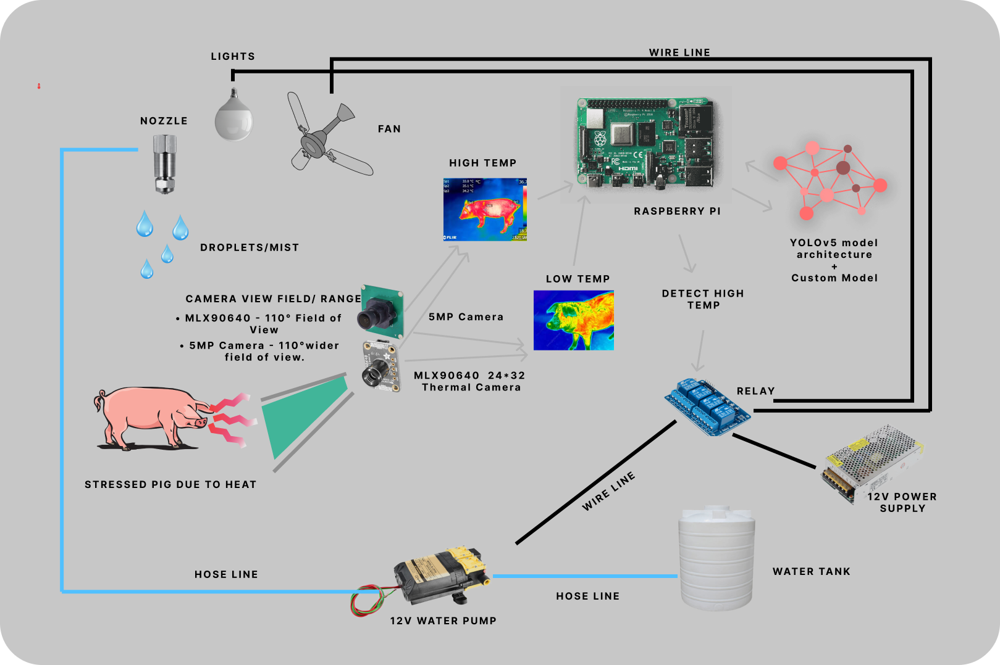
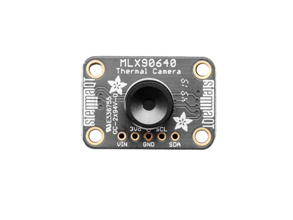

# PHS

## Introduction
**PHSM**, or **Pig Heat Stress Machine**, is a capstone project develop to help piggery owners to detect and automatically resolve any possible heat stress affecting the pigs. PHS machine gathers all information & details that is being monitored by the web-based system of PHSM.

PHS machine doesn't need any internet connection to function. The PHS runs on local network on the piggery and can be used to scan and connect other PHS machine on the same network.

## Technology Used

The machine uses machine learning & image processing technology to detect and resolve the heatstress problem on pigs

## Web Technology Used

The machine uses Mongodb for database that uses json like documents/record for storing data. NextJs that include Front-end (React.js) for dynamic and reusable web components. And Flask for realtime detection monitoring and PHS machine controls.

## Compatibility

PHS Machine utilizes **Raspberry Pi 4B** Architecture:**aarch64** only. Due to fund limitation, we only tested the system to run on **Pi 4B 8Gb** running version **Debian GNU/Linux 11 (bullseye) 64bit**. 

## Failed Compatibility

### **Debian GNU/Linux 11 (bullseye) 32bit** (not working)
We also attempted to install & run PHS but fails to run or not getting isntalled at all due to some dependency has been compiled and designed to function only on **64bit** os & system.

### Ubuntu (not working)
We also attempted to run it using **Ubuntu 64bit** (PHS does not work) but it lacks the advance IO and settings capability compared to **bullseye**.

## How PHS Works

The image above shows the **Conceptual Framework** of PHSM. The PHS rely on it's 2 sensor. The **Camera** and **Thermal Camera**.

### Thermal Radiation / Infrared Radiation

    (Credit: NASA's Imagine the Universe)

Any 0biects that has heat is emitting **infrared radiation**. Infrared radiation is one of the **electromagnetic waves** in the **electromagnetic spectrum**.

Human **cannot** see infrared on the naked eye. But we can **feel** it in the form of **heat**. **Thermal scanners** or **Thermal cameras** are being used to see the world of infrared. There's a wide variety of usage for thermal imaging including **health, security, research and science**. PHS uses thermal imaging to identify the intensity of thermal radiation emitting from the **pigs body** & uses **Convolutional Neural Network** for predicting or classifying it.

### Cooling the pig

PHS uses **Fan & Mist** to help reduce the pigs body **temperature**. PHS decide when to activate these components depending on the analyzed data from the camera & thermal camera.

### Yolov5 custom trained

PHS used a custom trained Yolov5 that is only trained to detect pig. The model is trained using the dataset we created in roboflow. It contains **11,374 images** of pigs. 

- **Training Set** : 9.9k images ( 87% )
- **Validation Set** : 944 images ( 8% )
- **Testing Set Set** : 482 images ( 4% )

The result of yolov5 custom trained model is shown bellow

### Custom CNN for identifying **Heat Stress**

PHS implements custom made **CNN** classify between HeatStress & Normal. It is trained with **5,072 Normal temperature** & **5,072 HeatStress tempareture**. The following graph shows the training accuracy & loss graph.

**accuracy**

    (Training/Validation) Accuracy Graph & Loss Graph

## The sensors

### MLX90640 Thermal(IR) Camera

    (Credit: Adafruit)

PHS uses **Adafruit MLX90640 Thermal Camera** which contains a **24x32** array of **IR thermal sensors** & **110°** field of view. It can measure **-40°C** to **300°C** with an accuracy of **+- 2°C** (in the 0-100°C range).

MLX90640 can be used in **Arduino boards** and in **Raspberry Pi**. The sensor communicates through **I2C** interface and can run from **3.3V** up to **5v**.

### SRICAM SriHome SH002 4MP 110 Degree Camera

    (Credit: SRICAM)

PHS also uses a camera to properly identify the pigs. The camera matches the **110° FOV** of thermal camera. The images from this camera are then feed to **Yolov5** object detection model. The model then returns **coordinates** where the system extract the data from the same coordinates in the thermal camera's thermal data.

> We both modified this cameras & combine it in a single casing to achieve thesame FOV alignment that will produce identical aligned image & thermal image.

## Contribute

We are open for contribution if you have a better idea to improve the system. We made the training scripts & datas available here. 

[Training Data](https://drive.google.com/drive/folders/1ySqsormrxzi2GBUkpTLrFrfWuoy8u3lo?usp=sharing)
