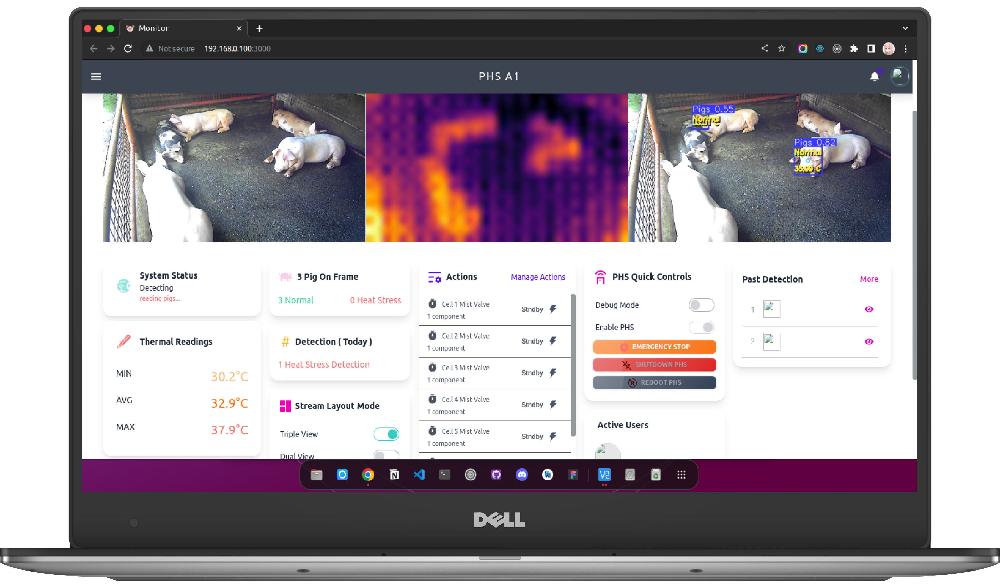

# PHS

### Introduction
**PHSM**, or **Pig Heat Stress Machine**, is a capstone project develop to help piggery owners to detect and automatically resolve any possible heat stress affecting the pigs. PHS machine gathers all information & details that is being monitored by the web-based system of PHSM.

PHS machine doesn't need any internet connection to function. The PHS runs on local network on the piggery and can be used to scan and connect other PHS machine on the same network.

### Technology Used

    

The machine uses machine learning & image processing technology to detect and resolve the heatstress problem on pigs

### Web Technology Used

    

The machine uses Mongodb for database that uses json like documents/record for storing data. NextJs that include Front-end (React.js) for dynamic and reusable web components. And Flask for realtime detection monitoring and PHS machine controls.

### Compatibility

    

PHS Machine utilizes **Raspberry Pi 4B** Architecture:**aarch64** only. Due to fund limitation, we only tested the system to run on **Pi 4B 8Gb** running version **Debian GNU/Linux 11 (bullseye) 64bit**. 

### Attempted Compatibility

#### **Debian GNU/Linux 11 (bullseye) 32bit** (not working)
We also attempted to install & run PHS but fails to run or not getting isntalled at all due to some dependency has been compiled and designed to function only on **64bit** os & system.

#### Ubuntu (not working)
We also attempted to run it using **Ubuntu 64bit** (PHS does not work) but it lacks the advance IO and settings capability compared to **bullseye**.