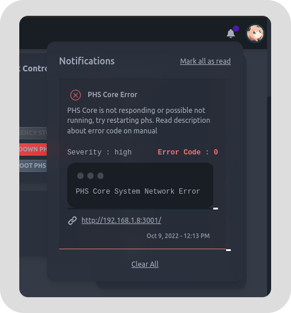
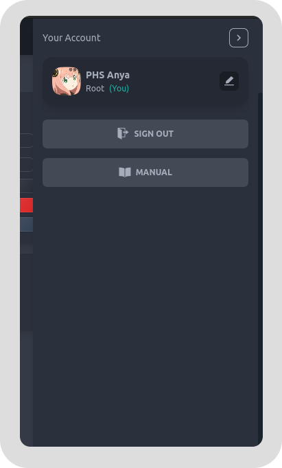
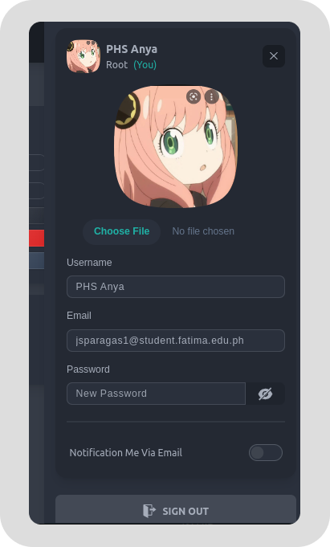

# Access & Authentication
See the basics about navigation and how to access / connect and gain authorization on PHS

## Accessing PHS

### PHS IP

On PHS Machine, there is a screen embeded on it's body. There are information that is written there that indicates the local IP and Port of the PHS Machine.

<center>
    
</center>

### Accessing Via Browser

You can type this on your web browser to access the PHS. This is the format of the url

```
http://<ip>:<port>
```

#### example
assuming IP : 192.168.1.8 & PORT : 3000 the url will be

```
http://192.168.1.8:3000
```


### Accessing Via SSH

You can connect via **SSH** on **CLI / Terminal / CMD**. You can look at the LCD screen on PHS Case to get the IP Address. By default, PHS system have the user name **phs**. You can use this 2 information to connect via **SSH**

#### example

assuming ip address is **192.168.1.8**. You can type this on your **CLI / Terminal / CMD**

```
ssh phs@192.168.1.8
```

### Accessing Via VNC

You can install **VNC** on your device and . You can look at the LCD screen on PHS Case to get the **IP** address. By default, PHS system have the user name **phs** with default password **helloworld**. You can use this 3 information to connect via **VNC**


Once you open VNC, you should place the ip and connect. If asked for user & password type the information mentioned above and then you should be able to connect & view the Raspberry Pi Desktop.


## Authentication / Login
PHS developers will provide you the initial account which is **ROOT Account** for the system. This ROOT account is the highest level of authorization on the system and cannot be deleted. This root account is used to create & manage other accounts on the system.

### Creating An Account

PHS machine doesn't have a sign up / create account endpoint to ensure that nobody can create and account freely and get access to the system. The developers will provide you the password for the pre-existing **root** account on the system. Only the **ROOT** & **Admin** account has the ability to create other account. You must contact or ask someone who have access to the **ROOT** or **Admin** account on the PHS system to create your account. 

You can email PHSM developers below if you have question or problem about the root account.

#### Devs
- jsparagas1@student.fatima.edu.ph

### Logging In
To access and monitor the detection history and realtime streaming of the system. You must first gain authorization by logging in to your account that is provided by **root** or **admin**. 

- **Step 1**: You must first have an account that is given by Admin or Root Admin. Contact your PHS Admin.


- **Step 2**: Type your credentials into the text box of login page of PHS,
 then Click the button **Sign In**.

### Forgot password

Contact **ROOT** or **Admin** to change your account password. Once they issue you your new password, you can change it on your account setting.

## The Basic Navigation
PHS provides navigation for easy navigating throughout the page. PHS Navbar include 3 parts

- Page Navigation ( handles page routes )
- Notifications ( handles notification alerts )
- User Navigation ( handles user related navigation )

### Page Navigation
Page navigation contains the **pages / routes** for easy switching of pages & also provides basic info about the current PHS.


### Notification
This shows important notification the system created. Notifications might show different notification types including **detection, alert, errors, info**. You can also clear this notification once read.



### User Nav
This provide basic information about you (current user), actions, and manual that you might need.



### Edit your account
You can edit your information by clicking the edit button and the following will going to show. After editing click save to save the changes.



#### NOTE
> The notification via email will only work if internet is available, if not, the system will attempty to send but will not be able to send the notifications to your Email address. 


