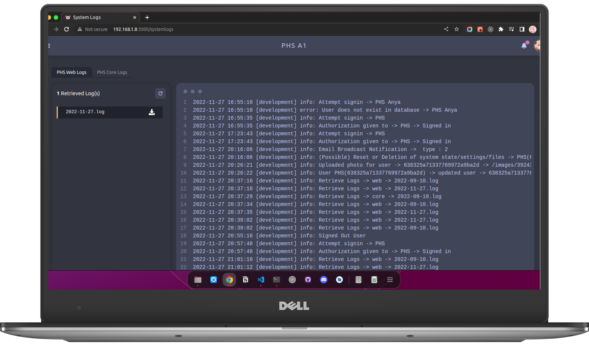

# PHS System Logs

PHS provide **log view** in order to track the history of PHS functions. Incase of failure, the problem can easily **track** & the logs can be downloaded & sent to **technical team** or **phs developers** for review. You can view **web logs & phs core logs** 

- **Web Logs** : are logs that is generated by the front-end web of PHS.
- **Core Logs** : are logs that is generated by the PHS Detection system.

> **NOTE** : Logs are helpful to trace faults & problems and can be reported to the developers. This will help developers to identify the cause of failure and fix them easily.