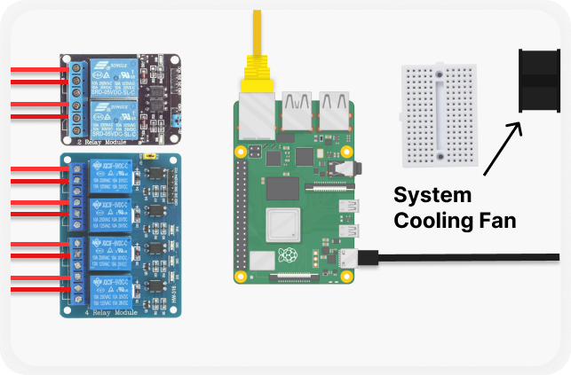

# Maintenance

PHSM should follow maintenance every **1st day of the month** to prevent possible failure on it's **Physical Hardware** & **Software**.

## Physical Maintenance

Before checking the **tubings, mist nozzle, relays, pump, valves** & **other** components, you should enable **debuggin mode** first at the **setting page**.

Debugging mode prevents the system from **toggling** the components **on** while you are checking them.

### Check System Cooling Fan 

PHS process a images, thermal images, manages components every seconds, that's why the processor of system get's **hot**. PHS cooling fan helps the **dissipation** of the device **heat** inorder to maintain it's ideal processing temperature. If the fan fails, the system will struggle to dissipate it's heat and might auto shutdown due to **t-junction** of the CPU. 

Out of the box, PHS is **pre-installed** with **heavy duty 5V high speed industrial fan** which life-span is much longer than any other fan. You can replace this with 5v fan if it fails.

### Check Tubing

Check tubing for **leaks** and fix them to prevent wasting water. You may turn off the entire PHS and it's components while the issue is not yet resolved.

### Checking Relays

Make sure that **Debugging Mode** is enabled in the **settings page**. Go to **relays** tab and try toggling the relay you wanted to test if it's working correctly or not. **Note** that the component that is attatched to that relay will also going **toggle/activate**.

    

If one of the relay module does **not** function correctly, replace the relay with the **same count** of relay module. Make sure to take a photo of the **order** of the wires attatched to the **relay module input controller pins**.

### Checking Pump ( Skip if not using pump )

Make sure that **Debugging Mode** is enabled in the **settings page**. To check if the pump functions correclty and producing enough pressure, you must go to the **settings page** > **relays** tab and toggle all relays that controls the **solenoid valves**. Now toggle on the relay that control the pump. Check if all nozzle produces ideal mist correctly.

### Checking Solenoid

Solenoid may get **clogged by debree** or the solenoid itself reach it's **lifespan and fails**. To check the solenoid valves, make sure that **Debugging Mode** is enabled in the **settings page**. Go to the **settings page** > **relays** tab and toggle on the relay that controls the pump. Then toggle **one by one** the relay that controls the solenoid valve you want to check. If the solenoid valve you are checking fails or have leak when turned off, you must replace it with the same **12V solenoid valve**.

### Checking Nozzle

Nozzle might be **blocked** by debree from the pipe, you can twist them to remove and clean the nozzle for **blockage** and put it back to test if it will produce ideal mist. If not, replace the nozzle.

## Software  Maintenance

PHS doesn't require you to do a lot of maintenance of it software but we only have 1 checklist to do for maintaining PHS Software to function smoothly. 

### The storage 

PHS only comes with **32Gb storage**. We know that Heat Stress on pig doesn't occurs every day. But we still consider that possibly a lot of heatstress will occurs and the storage will eventually **exceed 95%** of the storage. This might introduce **unwanted fault/errors** on the PHS. 

    

You can freeup space via **system reset** & **uncheck** all other options & only choosing these options under **Files & Logs**. Usually **Detection Raw Data** & **Exported Data** are the one that take most of the PHS storage.