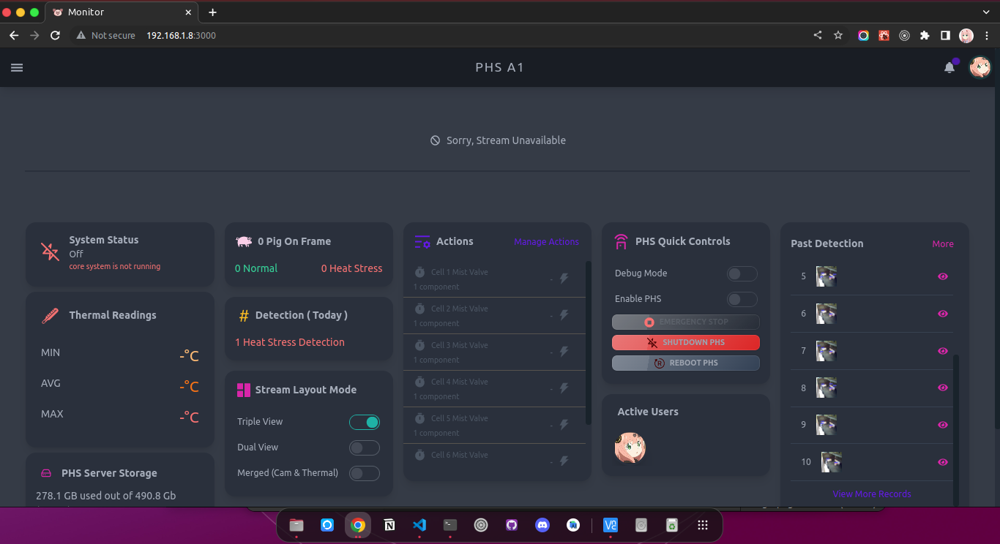
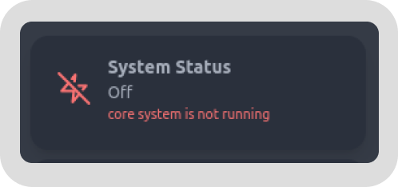
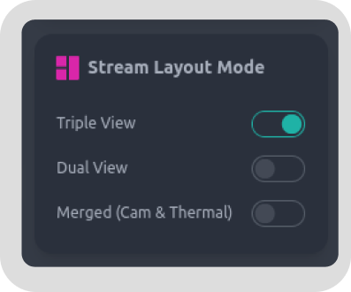

# Monitor Page

On this page, you will be able to see the streaming, and other information about the systems current data readings and configurations.

## Monitor Stream
This shows the streaming of what the PHS machine sees on its **Camera** & **Thermal Camera**. PHS machine will also show the annotated image of identified pig and their classification(HeatStress or Normal).

## System Status Indicator

This indicates that current state of the system. These states can be

- **Off** - Theres no communication from the PHS Detection System. This might indicate that the PHS Detection System is not running.
- **Disabled** - The PHS Detection System is running but it is disabled and will not detect nor resolve HeatStress
- **Connecting** - Attempt to connect to PHS Detection System
- **Debugging** - Resolving action is disabled to enable user to test relays and other PHS components that might be high voltage
- **Resolving** - The PHS Detection System is currently resolving a heatstress or running some actions
- **Detecting** - The normal status of PHS Detection System when scanning the area and the temperature of the pigs that is seen by the camera.

## Thermal Readings Indicator

This shows the **Minimum, Average, and Maximum** temperature the thermal camera is reading. 

## System Storage Indicator

This indicates of how many storage left for the system. Currently, the system is using **32Gb** but you can change it with bigger storage.

> NOTE: There are some limitaion and **file system format** types when changing PI storage size. You should read about Pi 4 **supported File System** types and **maximum supported storage** size to prevent problems.

> NOTE: If **auto delete** is enabled, when the system storage exceed **95%** of the total storage, The system will **auto delete** old records to accomodate new detection records.

## Seen Pig Indicator

This shows the count of pig that is being identified by the system. The system will also count and classify each detected pig to **HeatStress** or **Normal**.

## Detection Indicator

This shows how many detection happened today

## Stream Layout Option

This shows quick option for the Streaming Layout. You have 3 options

- **Tripple View** - Normal, Thermal, Annotated is displayed

- **Dual View** - Normal & Thermal are displayed

- **Merged View** - Normal & Thermal is merged together & displayed

## Actions Indicator

Actions indicator shows all actions that will be used by the system. It will show the **state** of the action and if the action is currently activated then the **duration** of activation will be displayed.

## Quick Controls Option

Quick controls is included to quickly change system state and setting without going to the settings page. If the system is **off** some of the controls will not be able to work.

## Active Users

This indicates the current active users that is also using or monitoring the system.

## Past Detection Indicator

Past detection shows the last 10 heat stress detections. You can **click** these to view more information about the detection record.